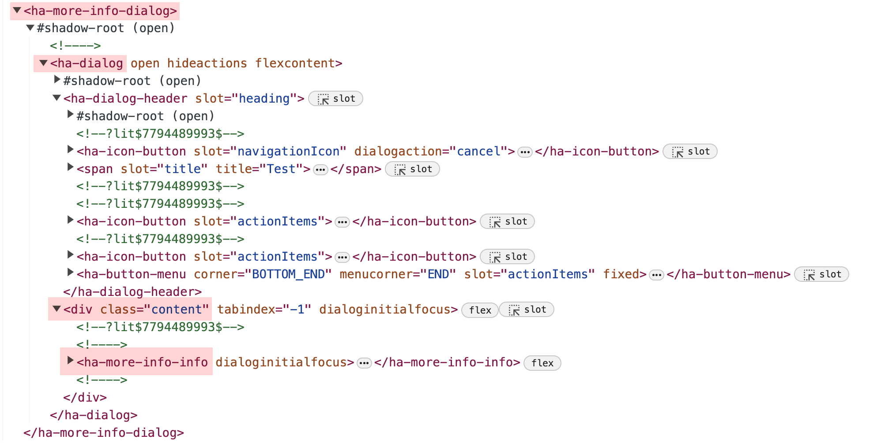

# home-assistant-query-selector (HAQuerySelector)

Easily query [Home Assistant] DOM elements in an asynchronous way.

[](https://github.com/elchininet/home-assistant-query-selector/actions/workflows/deploy.yaml)
[](https://github.com/elchininet/home-assistant-query-selector/actions/workflows/tests.yaml)
[](https://coveralls.io/github/elchininet/home-assistant-query-selector?branch=master)
[](https://badge.fury.io/js/home-assistant-query-selector)

[](https://github.com/elchininet/home-assistant-query-selector/actions/workflows/ha-beta-tests.yaml)

## Introduction

When one wants to build a `Home Assistant` front-end plugin, like many of the ones published in [HACS], most of the time first thing to do is dealing with query-selection of `DOM` elements. This is a tedius task, because `Home Assistant` elements are custom [WebComponents], so when the `DOM` loads, most of those elements don‘t exist, they will be created in an asynchronous way and not all of them at the same time. On top of that, as they are `WebComponents`, many of them have their own `DOM` subtree under a [ShadowDOM], something that makes the task of query-selecting elements double tedious.

As I develop and maintain several `Home Assistant` plugins that change the style of the `DOM` elements, I find myself repeating the same piece of logic over and over to select the elements, and when the `Home Asistant` front-end code changes ([something that occurs more than I would like](https://github.com/NemesisRE/kiosk-mode/issues/27)), I need to go and fix the same in all of them.

This is from where the idea of `home-assistant-query-selector` comes from. Imagine instantiating a class, and without querying for any element, through promises, just wait for the main `Home Assistant` DOM elements to be created and rendered to be able to access them. That sounds great! doesn‘t it?. In that way, the `Home Assistant` plugins that I maintain could be agnostic to the `DOM` tree, and if someting changes with a new version and all the plugins break at the same time, the changes to fix them could be done in a single place, to fix the plugins only a simple update of this library is needed once the patch is released.

### How to detect if something will break with a new Home Assistant version?

There are exhaustive end-to-end tests in place in this library, when a new version of `Home Assistant` is released, running the end-to-end tests in this repository will ensure that the library still works with the new version, so no need to manually check this.

#### End-to-end tests


#### Code coverage


### Code example

More details of the API can be consulted in [the API section](#api):

```typescript
import { HAQuerySelector } from 'home-assistant-query-selector';

const instance = new HAQuerySelector();

// This event will be triggered when the listen method is called
// You can also use the enum value HAQuerySelectorEvent.ON_LISTEN
instance.addEventListener('onListen', ({ detail }) => {

    const { HOME_ASSISTANT, HOME_ASSISTANT_MAIN, HA_SIDEBAR } = detail;

    // Querying the ha-sidebar element from the home-assistant element
    HOME_ASSISTANT.selector.$.query('home-assistant-main').$.query('ha-sidebar').element
        .then((sidebar) => {
            // sidebar === ha-sidebar element
        });

    // Deep-querying the sidebar element
    HOME_ASSISTANT.selector.deepQuery('ha-sidebar').element
        .then((sidebar) => {
            // sidebar === ha-sidebar element
        });

    // When the sidebar is available in the DOM
    HA_SIDEBAR.element
        then((sidebar) => {
            // Do whatever we want with the sidebar
        });
});

// This event will be triggered when any panel loads
// You can also use the enum value HAQuerySelectorEvent.ON_PANEL_LOAD
instance.addEventListener('onPanelLoad', ({ detail }) => {

    const { PARTIAL_PANEL_RESOLVER } = detail;

    // When the partial panel resolver is available in the DOM
    PARTIAL_PANEL_RESOLVER.element
        .then((partialPanelResolver) => {
            // Do whatever we want with the partial panel resolver
        });

});

// This event will be triggered every time a lovelace dashboard loads
// You can also use the enum value HAQuerySelectorEvent.ON_LOVELACE_PANEL_LOAD
instance.addEventListener('onLovelacePanelLoad', ({ detail }) => {

    const { HEADER, HA_PANEL_LOVELACE } = detail;

    // When the header is available in the DOM
    HEADER.element
        .then((header) => {
            // Do whatever we want with the header
        });    

    // Querying all the ha-icon-button elements inside the .action-items in the header
    HEADER.selector.query('.action-items ha-icon-button').all
        .then((buttons) => {
            // buttons === Search, Assist, and Open dashboard menu elements (top-right header buttons)
        });

    // Querying the hui-root shadowRoot
    HA_PANEL_LOVELACE.selector.$.query('hui-root').$.element
        .then((shadowRoot) => {
            // shadowRoot === hui-root‘s shadowRoot
        });

});

// This event will be triggered every time a more-info dialog is open
// You can also use the enum value HAQuerySelectorEvent.ON_MORE_INFO_DIALOG_OPEN
instance.addEventListener('onMoreInfoDialogOpen', ({ detail }) => {

    // When the ha-more-info-info element is available in the DOM
    detail.HA_MORE_INFO_DIALOG_INFO.element.then((dialogInfo) => {
        // Do whatever we want with the dialogInfo element
    });

});

// Start to listen
instance.listen();
```

## Installation of the library

#### npm

```bash
npm install home-assistant-query-selector
```

#### yarn

```bash
yarn add home-assistant-query-selector
```

#### PNPM

```bash
pnpm add home-assistant-query-selector
```

## API

### Class instantiation

The `HAQuerySelector` class can be instantiated sending an optional parameter, this parameter will decide how much time is required to query for each element before giving up.

```typescript
new HAQuerySelector([config])
```

#### config optional parameter

```typescript
{
    retries?: number;
    delay?: number;
    eventThreshold?: number;
}
```

| Parameter      | Optional      | Description                                         |
| -------------- | ------------- | --------------------------------------------------- |
| retries        | yes           | How many retries trying to find an element in the DOM tree before giving up (defaults to 100) |
| delay          | yes           | Delay between each retry trying to find an element in the DOM tree (defaults to 50)           |
| eventThreshold | yes           | Timestamp threshold to fire an event. If two consecutive events of the same type have a timestamp difference lower than this value, the second event will be ignored (defaults to 450) |

### Public methods

`HAQuerySelector` instances count with a public method. When it is called, this method will trigger the `onListen` and `onPanelLoad` (and `onLovelacePanelLoad` if the panel in which it is invoked is a lovelace panel) events inmediatly and start to watch for changes in the `DOM` to trigger the proper events.

```typescript
instance.listen();
```

### Events

The `HAQuerySelector` class extends from [EventTarget], so it is possible to add events listeners to it. It will dispatch events that will allow us to access the proper elements in the `DOM`.

#### onListen

This event is triggered when [the listen method](#public-methods) is called. It is useful if you only want to access the main Home Assistant elements only once.

```typescript
instance.addEventListener('onListen', function({detail}) {
    /* detail:
    {
        HOME_ASSISTANT: {...},
        HOME_ASSISTANT_MAIN: {...},
        HA_DRAWER: {...},
        ...
    }
    */
});
```

The dispatched event is a [CustomEvent] and its `detail` property is an object containing the main `Home Assistant` `DOM` elements. All the properties and methods included in each element are Promises, so they are async and will be resolved when the element is ready to work with it.

##### onListen event elements

This is the list of the elements available inside the `detail` property of the `onListen` event:


| Detail element           | DOM element              |
| ------------------------ | ------------------------ |
| `HOME_ASSISTANT`         | `home-assistant`         |
| `HOME_ASSISTANT_MAIN`    | `home-assistant-main`    |
| `HA_DRAWER`              | `ha-drawer`              |
| `HA_SIDEBAR`             | `ha-sidebar`             |
| `PARTIAL_PANEL_RESOLVER` | `partial-panel-resolver` |

All the available elements contain an `element` property and the `selector` property:

| Property or method        | Description                                                     |
| ------------------------- | --------------------------------------------------------------- | 
| `element`                 | Promise that resolves in the respective `DOM` element           |
| `selector`                | Object that allows one to query for elements using dot notation |

#### onPanelLoad

This event is triggered when [the listen method](#public-methods) is called or when any panel is loaded.

```typescript
instance.addEventListener('onPanelLoad', function({detail}) {
    /* detail:
    {
        HOME_ASSISTANT: {...},
        HOME_ASSISTANT_MAIN: {...},
        HA_DRAWER: {...},
        ...
    }
    */
});
```

The dispatched event is a [CustomEvent] and its `detail` property is an object containing the main `Home Assistant` `DOM` elements. All the properties and methods included in each element are Promises, so they are async and will be resolved when the element is ready to work with it.

##### onPanelLoad event elements

This is the list of the elements available inside the `detail` property of the `onPanelLoad` event:


| Detail element           | DOM element              |
| ------------------------ | ------------------------ |
| `HOME_ASSISTANT`         | `home-assistant`         |
| `HOME_ASSISTANT_MAIN`    | `home-assistant-main`    |
| `HA_DRAWER`              | `ha-drawer`              |
| `HA_SIDEBAR`             | `ha-sidebar`             |
| `PARTIAL_PANEL_RESOLVER` | `partial-panel-resolver` |

All the available elements contain an `element` property and the `selector` property:

| Property or method        | Description                                                     |
| ------------------------- | --------------------------------------------------------------- | 
| `element`                 | Promise that resolves in the respective `DOM` element           |
| `selector`                | Object that allows one to query for elements using dot notation |

#### onLovelacePanelLoad

This event is triggered when [the listen method](#public-methods) is called on a lovelace dashboard or when a lovelace dashboard is loaded.

```typescript
instance.addEventListener('onLovelacePanelLoad', function({ detail }) {
    /* detail:
    {
        HOME_ASSISTANT: {...},
        HOME_ASSISTANT_MAIN: {...},
        HA_DRAWER: {...},
        ...
    }
    */
});
```

The dispatched event is a [CustomEvent] and its `detail` property is an object containing the main `Home Assistant` `DOM` elements. All the properties and methods included in each element are Promises, so they are async and will be resolved when the element is ready to work with it.

##### onLovelacePanelLoad event elements

This is the list of the elements available inside the `detail` property of the `onLovelacePanelLoad` event:


| Detail element           | DOM element              |
| ------------------------ | ------------------------ |
| `HOME_ASSISTANT`         | `home-assistant`         |
| `HOME_ASSISTANT_MAIN`    | `home-assistant-main`    |
| `HA_DRAWER`              | `ha-drawer`              |
| `HA_SIDEBAR`             | `ha-sidebar`             |
| `PARTIAL_PANEL_RESOLVER` | `partial-panel-resolver` |
| `HA_PANEL_LOVELACE`      | `ha-panel-lovelace`      |
| `HUI_ROOT`               | `hui-root`               |
| `HEADER`                 | `.header`                |
| `HUI_VIEW`               | `hui-view`               |

All the available elements contain an `element` property and the `selector` property:

| Property or method        | Description                                                     |
| ------------------------- | --------------------------------------------------------------- | 
| `element`                 | Promise that resolves in the respective `DOM` element           |
| `selector`                | Object that allows one to query for elements using dot notation |

#### onMoreInfoDialogOpen

This event is triggered when a more-info dialog is open or when one returns to the main view of the more-info dialog from the `History` or `Settings` view inside the dialog.

```typescript
instance.addEventListener('onMoreInfoDialogOpen', function({detail}) {
    /* detail:
    {
        HA_MORE_INFO_DIALOG: {...},
        HA_DIALOG: {...},
        HA_DIALOG_CONTENT: {...},
        ...
    }
    */
});
```

The dispatched event is a [CustomEvent] and its `detail` property is an object containing the main `Home Assistant` `DOM` elements inside a more-info dialog. All the properties and methods included in each element are Promises, so they are async and will be resolved when the element is ready to work with it.

##### onMoreInfoDialogOpen event elements

This is the list of the elements available inside the `detail` property of the `onMoreInfoDialogOpen` event:



| Detail element             | DOM element              |
| -------------------------- | ------------------------ |
| `HA_MORE_INFO_DIALOG`      | `ha-more-info-dialog`    |
| `HA_DIALOG`                | `ha-adaptive-dialog`     |
| `HA_DIALOG_CONTENT`        | `.content`               |
| `HA_MORE_INFO_DIALOG_INFO` | `ha-more-info-info`      |

All the available elements contain an `element` property and three methods:

| Property or method        | Description                                                     |
| ------------------------- | --------------------------------------------------------------- | 
| `element`                 | Promise that resolves in the respective `DOM` element           |
| `selector`                | Object that allows one to query for elements using dot notation |

#### onHistoryAndLogBookDialogOpen

This event is triggered when the `History` view is opened from the header actions of a more-info dialog.

```typescript
instance.addEventListener('onHistoryAndLogBookDialogOpen', function({detail}) {
    /* detail:
    {
        HA_MORE_INFO_DIALOG: {...},
        HA_DIALOG: {...},
        HA_DIALOG_CONTENT: {...},
        ...
    }
    */
});
```

The dispatched event is a [CustomEvent] and its `detail` property is an object containing the main `Home Assistant` `DOM` elements inside a more-info dialog `History` view. All the properties and methods included in each element are Promises, so they are async and will be resolved when the element is ready to work with it.

##### onHistoryAndLogBookDialogOpen event elements

This is the list of the elements available inside the `detail` property of the `onHistoryAndLogBookDialogOpen` event:


| Detail element                            | DOM element                        |
| ----------------------------------------- | ---------------------------------- |
| `HA_MORE_INFO_DIALOG`                     | `ha-more-info-dialog`              |
| `HA_DIALOG`                               | `ha-adaptive-dialog`               |
| `HA_DIALOG_CONTENT`                       | `.content`                         |
| `HA_DIALOG_MORE_INFO_HISTORY_AND_LOGBOOK` | `ha-more-info-history-and-logbook` |

All the available elements contain an `element` property and three methods:

| Property or method        | Description                                                     |
| ------------------------- | --------------------------------------------------------------- | 
| `element`                 | Promise that resolves in the respective `DOM` element           |
| `selector`                | Object that allows one to query for elements using dot notation |

#### onSettingsDialogOpen

This event is triggered when the `Settings` view is opened from the header actions of a more-info dialog.

```typescript
instance.addEventListener('onSettingsDialogOpen', function({detail}) {
    /* detail:
    {
        HA_MORE_INFO_DIALOG: {...},
        HA_DIALOG: {...},
        HA_DIALOG_CONTENT: {...},
        ...
    }
    */
});
```

The dispatched event is a [CustomEvent] and its `detail` property is an object containing the main `Home Assistant` `DOM` elements inside a more-info dialog `Settings` view. All the properties and methods included in each element are Promises, so they are async and will be resolved when the element is ready to work with it.

##### onSettingsDialogOpen event elements

This is the list of the elements available inside the `detail` property of the `onSettingsDialogOpen` event:


| Detail element                 | DOM element             |
| ------------------------------ | ----------------------- |
| `HA_MORE_INFO_DIALOG`          | `ha-more-info-dialog`   |
| `HA_DIALOG`                    | `ha-adaptive-dialog`    |
| `HA_DIALOG_CONTENT`            | `.content`              |
| `HA_DIALOG_MORE_INFO_SETTINGS` | `ha-more-info-settings` |

All the available elements contain an `element` property and three methods:

| Property or method        | Description                                                     |
| ------------------------- | --------------------------------------------------------------- | 
| `element`                 | Promise that resolves in the respective `DOM` element           |
| `selector`                | Object that allows one to query for elements using dot notation |

### Note

>The `selector` property used in the library uses behind the secenes the [AsyncSelector] class from [shadow-dom-selector], which is highly inspired in the query philosophy of [lovelace-card-mod].


[Home Assistant]: https://www.home-assistant.io
[HACS]: https://hacs.xyz
[WebComponents]: https://www.webcomponents.org
[ShadowDOM]: https://developer.mozilla.org/en-US/docs/Web/API/Web_components/Using_shadow_DOM
[EventTarget]: https://developer.mozilla.org/en-US/docs/Web/API/EventTarget
[CustomEvent]: https://developer.mozilla.org/en-US/docs/Web/API/CustomEvent
[AsyncSelector]: https://github.com/elchininet/shadow-dom-selector#asyncselector-class
[shadow-dom-selector]: https://github.com/elchininet/shadow-dom-selector
[lovelace-card-mod]: https://github.com/thomasloven/lovelace-card-mod
