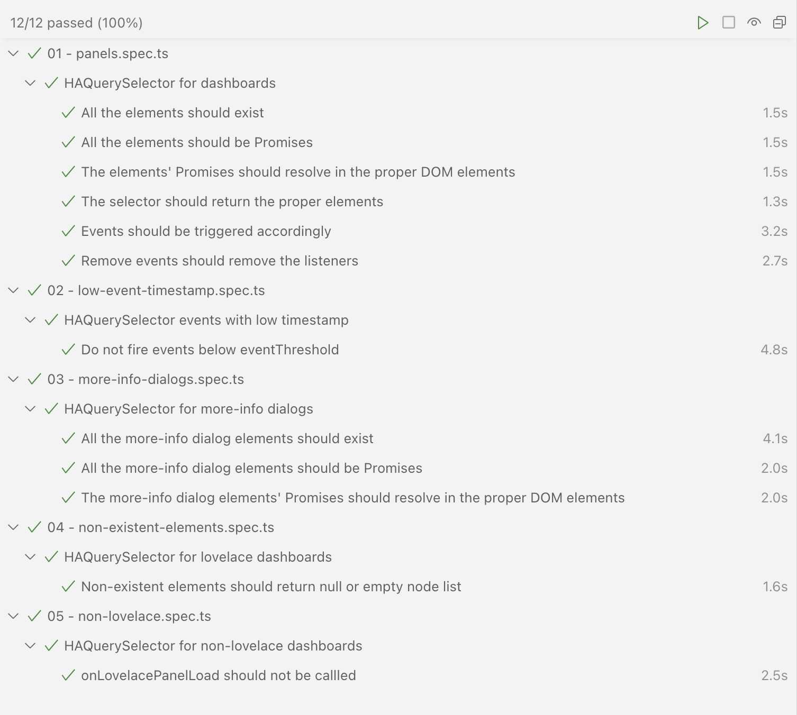

# home-assistant-query-selector (HAQuerySelector)

Easily query [Home Assistant] DOM elements in an async way.

[](https://github.com/elchininet/home-assistant-query-selector/actions/workflows/deploy.yaml) &nbsp; [](https://coveralls.io/github/elchininet/home-assistant-query-selector?branch=master) &nbsp; [](https://badge.fury.io/js/home-assistant-query-selector)

## Introduction

When one wants to build a `Home Assistant` front-end plugin, like many of the ones published in [HACS], first thing to do most of the time is dealing with query-selection of `DOM` elements. This is a tedius task, because `Home Assistant` elements are custom [WebComponents], so when the `DOM` loads, most of those elements don‘t exist, they will be created in an asynchronous way and not all of them at the same time. On top of that, as they are `WebComponents`, each one has its own `DOM` subtree under a `ShadowDOM`, something that makes the task of query-selecting elements double tedious.

As I develop and maintain several Home Assistant plugins that needs to do the aforementioned tedious task, I find myself repeating the same piece of logic over and over, and when the front-end code of `Home Asistant` changes ([something that occurs more than I would like](https://github.com/NemesisRE/kiosk-mode/issues/27)), you can imagine what needs to be done in all those plugins.

This is from where the idea of `home-assistant-query-selector` comes from. Imagine insteantiating a class, and without querying for any element, just wait for them to be created and rendered in the `DOM`, and after that, a function that you have created gets automatically executed. That would be handy, because in that way, `Home Assistant` plugins could be agnostic to the `DOM` tree, and if someting changes with a new version and all the plugins break at the same time, the changes to fix it could be done in a single place, the rest of the plugins just need to update to the new version of this library once the patch is released.

And something very important, [several end-to-end tests are in place in this library](https://github.com/elchininet/home-assistant-query-selector/actions/runs/6909640095/job/18801363213), if one wants to test if the new version of Home Assistant will break something from the library, one just needs to run a command and a series of test will be run to check that.



So, this is a quick summary about how this library works:

```typescript
import { HAQuerySelector } from 'home-assistant-query-selector';

const instance = new HAQuerySelector();

//This event will be triggered every time the lovelace dashboard changes
instance.addEventListener('onLovelacePanelLoad', ({detail}) => {

    // When the header gets ready to work with it
    detail.HEADER.element
        .then((header) => {
            // Do whatever we want with the header
        });
    
    // When the sidebar gets ready to work with it
    detail.HA_SIDEBAR.then((sidebar) => {
        // Do whatever we want with the sidebar
    });
});

// Start to listen
instance.listen();
```

## Installation

#### npm

```bash
npm install home-assistant-query-selector
```

#### yarn

```bash
yarn add home-assistant-query-selector
```

#### PNPM

```bash
pnpm add home-assistant-query-selector
```

## API

### Class instantiation

The `HAQuerySelector` class can be instantiated sending an optional parameter, this parameter will decide how much time is required to query for each element before giving up.

```typescript
new HAQuerySelector([config])
```

#### config optional parameter

```typescript
{
    retries?: number;
    delay?: number;
}
```

| Parameter    | Optional      | Description                                         |
| ------------ | ------------- | --------------------------------------------------- |
| retries      | yes           | How many retries before giving up (defaults to 100) |
| delay        | yes           | Delay between each retry (defaults to 50)           |

### Public methods

`HAQuerySelector` instances count with a public method. This method triggers inmediatly an event with the elements and watches for changes of the `partial-panel-resolver` (every time that one navigates out of the dashboard and comes back again, this event will be triggered with an update of the elements).

```typescript
instance.listen();
```

### Events

The `HAQuerySelector` class extends from [EventTarget], so it is possible to add events listeners to it. It will dispatch only one event (`onLovelacePanelLoad`) and it will be triggered when the [listen public method](#public-methods) is executed or when the lovelace dashboard changes (every time that the lovelace dashboard containing your code is selected from the sidebar).

```typescript
instance.addEventListener('onLovelacePanelLoad', function({detail}) {
    /* detail:
    {
        HOME_ASSISTANT: {...},
        HOME_ASSISTANT_MAIN: {...},
        HA_DRAWER: {...},
        HA_SIDEBAR: {...},
        PARTIAL_PANEL_RESOLVER: {...},
        ...
    }
    */
});
```

The dispatched event is a [CustomEvent] and its `detail` property is an object containing all the `Home Assistant`‘s main elements.

### Available elements

This is the list of the elements available inside the `CustomEvent` `detail` property:


| Detail element           | DOM element              |
| ------------------------ | ------------------------ |
| `HOME_ASSISTANT`         | `home-assistant`         |
| `HOME_ASSISTANT_MAIN`    | `home-assistant-main`    |
| `HA_DRAWER`              | `ha-drawer`              |
| `HA_SIDEBAR`             | `ha-sidebar`             |
| `PARTIAL_PANEL_RESOLVER` | `partial-panel-resolver` |
| `HA_PANEL_LOVELACE`      | `ha-panel-lovelace`      |
| `HUI_ROOT`               | `hui-root`               |
| `HEADER`                 | `.header`                |
| `HUI_VIEW`               | `hui-view`               |

All the available elements contain the same `element` property and three methods:

| Property or method        | Description                                                  |
| ------------------------- | ------------------------------------------------------------ | 
| `element`                 | Promise that resolves in the DOM element                     |
| `querySelector`           | Method to query for descendants of this element              |
| `querySelectorAll`        | Method to query multiple decendants elements of this element |
| `shadowRootQuerySelector` | Method to query for descendants shadowRoots of this element  |

>`querySelector`, `querySelectorAll` and `shadowRootQuerySelector` return a Promise that resolves in the element specified by their query. Behind the secenes, they use the [asyncQuerySelector], [asyncQuerySelectorAll] and [asyncShadowRootQuerySelector] functions from [shadow-dom-selector], which is highly inspired in the query philosophy of [lovelace-card-mod].

#### Examples

```typescript
detail.HOME_ASSISTANT.querySelector('$ home-assistant-main$ ha-sidebar')
    .then((sidebar) => {
        // sidebar === ha-sidebar element
    });

detail.HEADER.querySelectorAll('.action-items ha-icon-button')
    .then((buttons) => {
        // buttons === Search, Assist, and Open dashboard menu elements (top-right header buttons)
    });

// In all the methods one can Specify custom retries and delay
detail.HA_PANEL_LOVELACE.shadowRootQuerySelector('$ hui-root$', { retries: 50, delay: 20 })
    .then((shadowRoot) => {
        // shadowRoot === hui-root‘s shadowRoot
    });
```


[Home Assistant]: https://www.home-assistant.io
[HACS]: https://hacs.xyz
[WebComponents]: https://www.webcomponents.org
[ShadowDOM]: https://developer.mozilla.org/en-US/docs/Web/API/Web_components/Using_shadow_DOM
[EventTarget]: https://developer.mozilla.org/en-US/docs/Web/API/EventTarget
[CustomEvent]: https://developer.mozilla.org/en-US/docs/Web/API/CustomEvent
[asyncQuerySelector]: https://github.com/elchininet/shadow-dom-selector#asyncqueryselector
[asyncQuerySelectorAll]: https://github.com/elchininet/shadow-dom-selector#asyncqueryselectorall
[asyncShadowRootQuerySelector]: https://github.com/elchininet/shadow-dom-selector#asyncshadowrootqueryselector
[shadow-dom-selector]: https://github.com/elchininet/shadow-dom-selector
[lovelace-card-mod]: https://github.com/thomasloven/lovelace-card-mod
